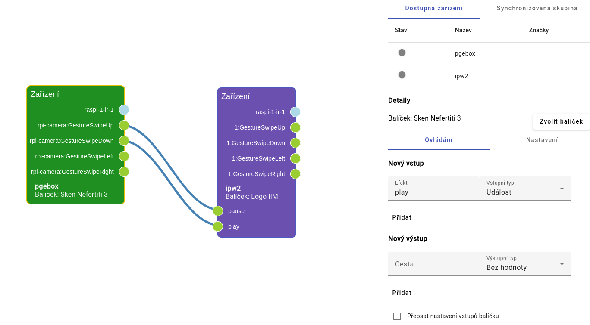
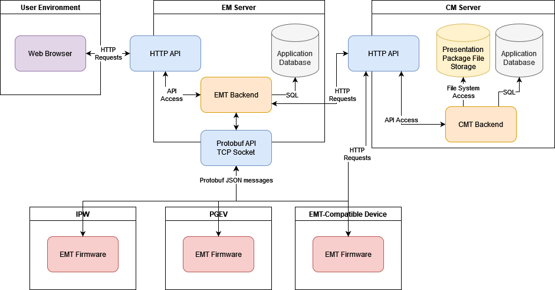

# Správce expozice (Exposition Manager)

Software pro centrální ovládání expozice (Správce expozice, dále také EM)  je nástroj pro interaktivní tvorbu definice expozice pomocí dostupných prezentačních zařízení a multimediálních dat. Tento nástroj umožňuje spravovat jednotlivé zdroje (zařízení a obsah) a definovat mezi nimi vztahy, které umožní komunikaci mezi prezentacemi a návštěvníkem a mezi jednotlivými zařízeními navzájem.

## Architektura

EM je rozdělen na dvě části:
- [Frontend](https://github.com/iimcz/emtoolbox/tree/master/frontend) - Aplikace založená na frameworku Angular, poskytující webové rozhraní EM.
- [Backend](https://github.com/iimcz/emtoolbox/tree/master/backend) - Serverová aplikace, která zprostředkovává komunikaci se Správcem obsahu a zobrazovacími zařízeními, založená na ASP.NET Core.

## Dokumentace

Celková dokumentace Správce expozice je dostupná zde:

[Software pro centrální ovládání expozice - Dokumentace](https://raw.githubusercontent.com/iimcz/emtoolbox/master/Doc/em_dokumentace.pdf)